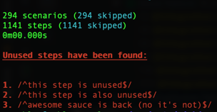

# Cucumber.js Step Usages

This small node module helps you find:

1. Steps that are defined but not utilized
1. How many times a step is utilized (planned?)

Example output when finding steps that are defined but not utilized:



## Installation

> This is intended to work with [cucumber-js version 1.x only](https://github.com/cucumber/cucumber-js/tree/1.x).

First, install the module as a dev dependency:

```
npm install --save-dev cucumberjs-step-usages
```

Next, import / require the module and call the desired report. For example, this file `features/step_definitions/hooks.js`:

```javascript 1.8
const cucumberJsStepUsages = require("cucumberjs-step-usages");
module.exports = function () {
    this.setDefaultTimeout(60000);
    
    cucumberJsStepUsages.findUnusedSteps(this);

    // Other setup things that you want to do goes here
};
```

## Find step usages

You can find steps usages fast by running Cucumberjs in dry-run mode. For example: `cucumber.js --dry-run ./features`.
